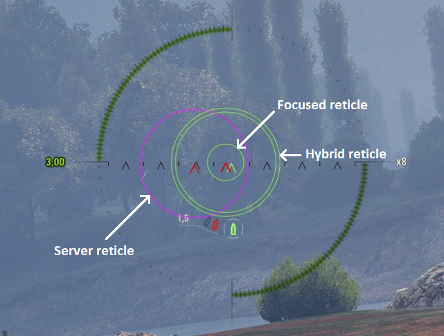
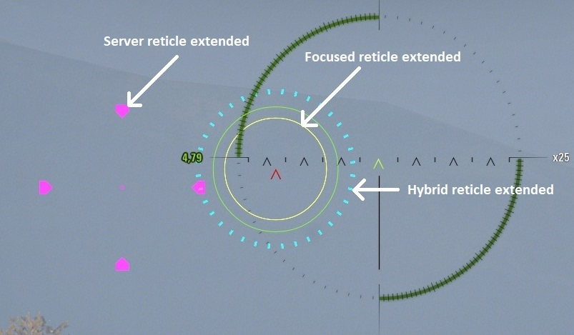
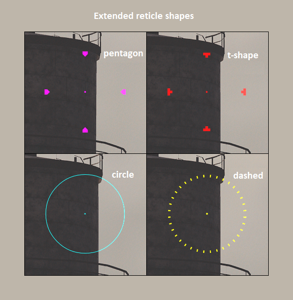

## DispersionReticle
Updated and completely reworked mod that adds additional circle displaying fully focused dispersion of a gun.

Original idea by **StranikS_Scan**, completely reworked by me.

Also, over time, this mod now contains **following mutually compatible mods**:
- Focused reticle
- Server reticle
- Hybrid reticle (smooth combination of client and server reticle)
- Reticle Size (adjustment in config file)

## Features
All of those features can be enabled/adjusted **independently**.

They are also compatible with "Use server aim" from in-game option.

**Focused reticle** (enabled by default):
- adds green reticle displaying **fully focused dispersion** alongside others reticles

**Server reticle**
- adds purple **server-side reticle** alongside with **client-side reticle**

**Hybrid reticle**:
- adds green reticle displaying **current server-side dispersion** to **client-side reticle**
- useful if you want to know server-side dispersion, but still want client-side responsiveness

**Extended variants of above reticles**
- have much more customization options
- visually inspired by **AwfulTanker's Server Marker**

**Reticle size**
- controlled by "reticle-size-multiplier" option
- WG's displayed reticle dispersion is noticeably bigger than actual gun dispersion
- it was discovered by **Jak_Attackka**, **StranikS_Scan** and others
- by this setting you can scale it to actual dispersion
- good known values:
    - 1.0 (default "wrong" WG dispersion)
    - 0.5814 (factor determined by me)
    - 0.5848 (factor determined by **Jak_Attackk**a, **StranikS_Scan** and others)

## Feedback
You can:
- PM me on discord: **fierioziy** (nick: **Pruszko \[EU\]** on [WoT official discord](https://discord.gg/world-of-tanks))
- in game on EU server: **Pruszko**
- or [GitHub issues here](https://github.com/Pruszko/DispersionReticle/issues).

## Configuration
All features from config file **are reloadable on-the-fly** using **CTRL + P** hotkey in the game **anywhere**.

This mod also supports **Mod Configurator by IzeBerg** allowing for configuring
this mod using its GUI in garage.

## Resource
Websites where mod is uploaded directly by me:
- [GitHub Releases Page](https://github.com/Pruszko/DispersionReticle/releases) (direct and fastest)
- [WGMods](https://wgmods.net/5251/) (WG approved)
- [CurseForge](https://www.curseforge.com/worldoftanks/wot-mods/dispersionreticle-reworked) (curseforge approved)

## Installation
1. Copy "DispersionReticle.wotmod" file (and optionally other *.wotmod files)
   extracted from zip into "[WoT game directory]/mods/[version]/" directory
2. Run a game with mod installed to generate default config file
3. Adjust config to your liking
4. Reload it in-game whenever you want by using CTRL + P hotkey
5. (with Mod Configurator) Open button with "<>" icon in garage and find DispersionReticle section to configure mod

Full config file location: **"[WoT game directory]/mods/configs/DispersionReticle/config.json"**

Use some text editor (preferably **Notepad++**) to edit config file.

## Contributions
Thanks to:
* **IzeBerg** - for cool GUI configuration API
* **POLIROID** - for ModsListAPI and GamefaceAPI
* **shuxue** - for Russian translations
* **yinx2002** - for Chinese translations
* **Kurzdor** - for occasional help

## Compatibility
This mod **IS NOT** compatible with other mods with similar features as mine.

Current known incompatible mods:
- AwfulTanker's Server Marker (and other similar)
- Jak_Atackka's Better Reticle Size (and other similar)

Use preferred options from above features for similar functionality instead.

However, it should be compatible with any crosshair mods that changes
how crosshair or reticle looks like.